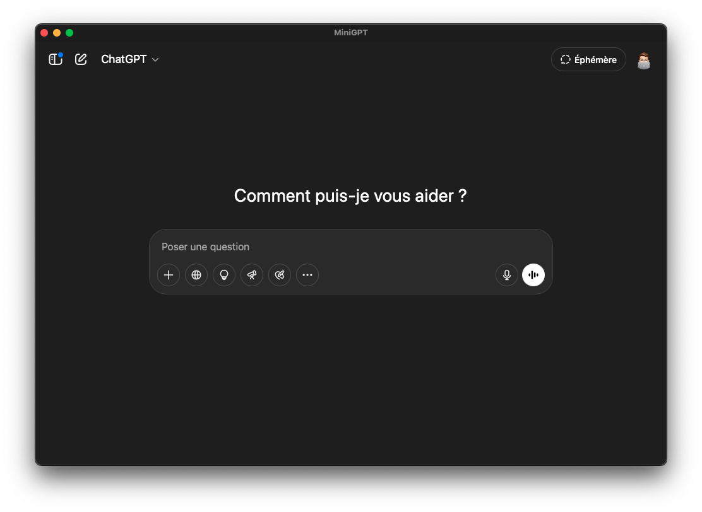

# MiniGPT (Intel)

<!-- Image de l'app -->

## Overview

A super lightweight macOS app that brings classic ChatGPT to your desktop — like a hidden search engine.  
Built with [Tauri](https://tauri.app) for low RAM and CPU usage, especially on Intel Macs.

## Features

- Minimal interface
- Custom app icon
- Fast loading ChatGPT window
- Runs natively on macOS Intel

## Install

```bash
pnpm install
pnpm tauri dev
